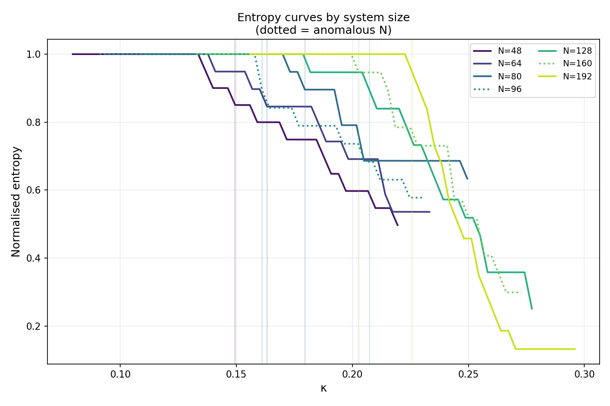
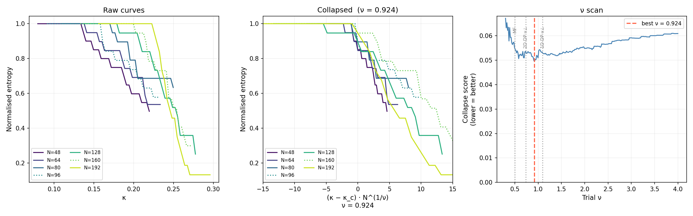

# Fitness-Weighted Network Phase Transitions

## What This Is

This project (Muriel's Theory) simulates a network of N nodes,
each assigned a fitness value drawn from a lognormal distribution.
Connections between nodes evolve over time under competing forces:
fitness-driven reinforcement, decay, saturation, and global pressure.
At a critical coupling strength κ_c, the network transitions sharply
from a diffuse state (influence spread across all nodes) to a
concentrated state (a small number of hub nodes holding most of
the influence).

The central question: does this transition exhibit universal behaviour
across different levels of fitness heterogeneity?

## Main Finding

The onset of the transition scales with network size as a power law:

    κ_c ≈ A · N^slope

Testing three fitness heterogeneity values (σ = 0.40, 0.45, 0.50)
across system sizes N = 48 to 192:

| σ    | β (exponent) | A (prefactor) | rel_err |
|------|-------------|---------------|---------|
| 0.40 | 0.310       | 0.0509        | 0.016   |
| 0.45 | 0.304       | 0.0465        | 0.015   |
| 0.50 | 0.291       | 0.0444        | 0.016   |

**β ≈ 0.301 ± 0.009 across all sigma values.**

The scaling exponent is stable across fitness heterogeneity,
consistent with universality. The prefactor A decreases with σ,
meaning higher fitness inequality lowers the transition threshold.

## Onset Table

| N   | σ=0.40  | σ=0.45  | σ=0.50  | note        |
|-----|---------|---------|---------|-------------|
| 48  | 0.16793 | 0.14947 | 0.13554 |             |
| 64  | 0.18186 | 0.16322 | 0.14712 |             |
| 80  | 0.20031 | 0.17950 | 0.16105 |             |
| 96  | 0.17950 | 0.16105 | 0.14477 | anomaly     |
| 128 | 0.23505 | 0.20737 | 0.18638 |             |
| 160 | 0.23053 | 0.20266 | 0.17950 | anomaly     |
| 192 | 0.25368 | 0.22582 | 0.20031 |             |

## A Noted Anomaly

N=96 sits consistently ~10% below the expected power law at every
sigma value. N=160 shows a softer version (~2%). This anomaly is:

- Reproducible across 16-32 random seeds
- Independent of fitness heterogeneity
- Not explained by convergence, seed noise, or grid alignment

Both are excluded from the power law fit. Spectral analysis shows
the gap ratio between the first and second eigenvalue gaps is
consistently lower at both sizes than at neighbouring sizes, across
all three sigma values and 24 seeds. This pattern is consistent with
earlier onset at those sizes. Why these specific sizes show this
spectral structure is an open question.

## Two Populations Emerge Above the Transition

Clustering analysis above the transition shows two natural groupings:

- **Hubs** (~7% of nodes): hold ~54% of total network influence,
  mean fitness 1.17x the network average
- **Field** (~93% of nodes): share the remaining ~46% of influence

Below the transition all nodes form a single uniform population.
The hub/field distinction does not exist before κ_c is crossed.

## Methodological Notes

- **Adaptive convergence**: runs use up to 800 steps with early
  stopping when entropy plateaus. Fixed step counts were insufficient
  for large N near the transition.

- **Seeds**: 16 seeds per configuration. Analysis showed 4 seeds
  produced noisy onset estimates at small N.

- **Two-stage grid**: coarse sweep (20 points) locates the transition;
  fine sweep (35 points over +/-0.04) sharpens the estimate, reducing
  onset uncertainty from ~10% to ~1-2%.

- **Onset criterion**: entropy drop > 0.20 OR leading eigenvector
  localisation ratio > 5.0. Core ratio was tested and removed as it
  showed size-dependent bias.

## What This Study Claims and Does Not Claim

**Claims:**
- Fitness-weighted networks undergo a reproducible phase transition
- The transition has a universal scaling exponent β ≈ 0.301
- Universality holds across the fitness heterogeneity values tested
- The transition produces a measurable hub/field population split
- The spectral anomaly at N=96 and N=160 is verified and consistent

**Does not claim:**
- The analytical origin of β ≈ 0.301
- Whether this universality class applies to physical or biological systems
- Any interpretation of the hub/field split beyond network structure
- Universality class identification — further work is needed

## Follow-up Analysis (Preliminary)

A follow-up analysis measuring the order parameter exponent and
correlation length exponent is underway. Two methods for estimating
the correlation length exponent give inconsistent results and further
work is needed before any universality class identification can be
claimed. Figures are included for reference only.

## Technical Parameters

- dt = 0.005, max_steps = 800, converge_tol = 1e-4
- α = 0.50, β_decay = 0.10, μ = 0.25, noise_σ = 0.001
- target_mean_W = 0.02
- Fitness: lognormal(mean=0, sigma=σ), normalised to mean=1
- Onset criterion: entropy_drop > 0.20 OR v1loc_ratio > 5.0
- Seeds: 16 per configuration
- System sizes: N = 48, 64, 80, 96, 128, 160, 192

## Next Steps

1. Resolve inconsistency in correlation length exponent estimates
2. Analytical derivation of β from first principles
3. Independent verification in a physical or biological network
4. Larger system sizes (N=256+) to further anchor the power law

## Status

Preliminary findings. Not peer reviewed.
Feedback and collaboration welcome.
